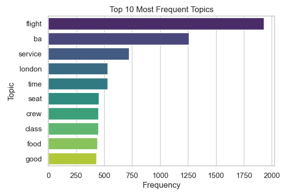

# British Airways Customer Reviews Sentiment Analysis

## Description
This notebook presents a sentiment analysis of customer reviews for British Airways. The goal is to understand customer sentiments and identify key areas of satisfaction and dissatisfaction. The analysis includes data preprocessing, sentiment analysis, and visualization of the results.
## About the files
- **customer_reviews.csv**: The data was scraped from [Skytrax](https://www.airlinequality.com/airline-reviews/british-airways) using Beautiful Soup

## Author
Rishiraj Sinharay, a Data Scientist with experience in data analysis, statistical modeling, and data visualization. Currently working on various projects involving data science and machine learning.

## Reference
The Forage - [British Airways](https://www.theforage.com/simulations/british-airways/data-science-yqoz)

