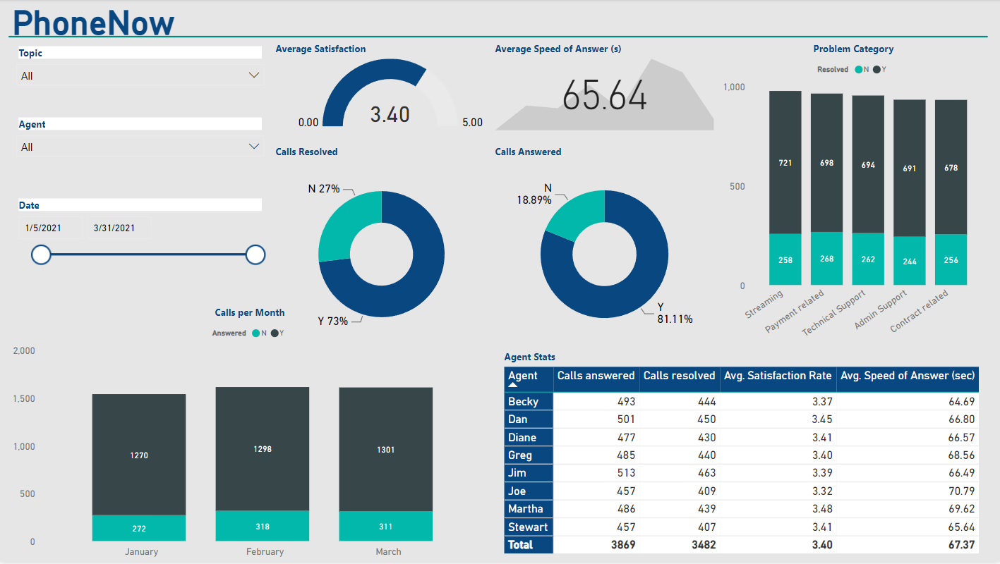

# Call Center KPI Dashboard

## Description
This dashboard presents a visualization of key performance indicators (KPIs) and metrics using Power BI. The objective is to provide a clear and interactive representation of the data, focusing on various essential metrics derived from the provided dataset. The visualization includes dynamic charts and graphs that enhance data interpretation and decision-making, utilizing insights from supporting resources such as podcasts and articles.
## About the files
- **01 Call-Center-Dataset.xlsx**: This file contains data on call center metrics.
## Author
Rishiraj Sinharay, a Data Scientist with experience in data analysis, statistical modeling, and data visualization. Currently working on various projects involving data science and machine learning.
